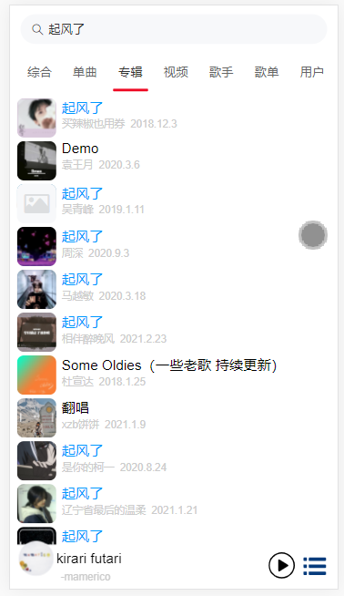

# 网易云仿移动端音乐

## 说明

- 技术栈：Vue3 + Vant + Pinia + Typescript + Vite2
- 线上预览：https://wudeh.github.io/Flutter_web_deploy（PC 请 F12 切换为移动端 或者使用手机浏览器扫描以下二维码）
- 数据来源：https://github.com/Binaryify/NeteaseCloudMusicApi
- Flutter 版：https://github.com/wudeh/flutter_music_code
- 对您有一丁点帮助的话给个 star 吧 【哭唧唧】
- 试听的歌曲只能下载到片段，而且项目里默认下载的不是无损音质，想要无损音质可以尝试使用 Flutter 版，默认下载的是无损音质

- 2021-11-28：从 webpack 迁移到 vite，状态管理换成 pinia，使用 setup 语法糖

## 主要完成功能

- 播放：列表循环播放，单曲循环播放，随机循环播放，播放上一首，播放下一首
- 歌词滚动高亮
- 进度控制：时间进度条拖动，歌词时间进度拖动
- 声音大小拖动控制
- 音乐下载
- 搜索单曲，歌单，视频，MV，歌手，专辑，电台，用户
- 视频播放
- 等等（其他功能重复的有点多，将来有机会再开发，也可能鸽了）

## 截图

  
  
 

  

  

  

  

  

## Project setup

```
npm install
```

### Compiles and hot-reloads for development

```
npm run serve
```

### Compiles and minifies for production

```
npm run build
```
