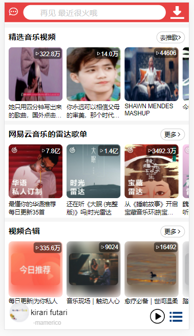
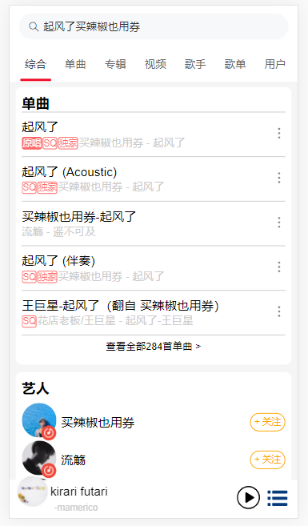

# 网易云移动端音乐

## 说明
- 技术栈：Vue3 + Vant + better-scroll + Typescript + Vite 2.0
- 线上预览：https://neteasecloudmusic.vercel.app
- 数据来源：https://github.com/Binaryify/NeteaseCloudMusicApi
- 作为一个开源项目，大概主要亮点就是实现了歌词进度拖动功能吧，虽然在 GitHub 上网易云音乐项目已经被做烂了，不过我翻了半天项目都没找到有比较完整地实现全部音乐播放的项目，选择模仿安卓移动端主要是因为移动端的音乐播放功能要考虑实现的功能更多，所以本项目主要集中于实现音乐播放的相关功能，不会致力于实现全部移动端的网易云音乐功能；各位如果有兴趣的可以考虑自己实现。

## 主要完成功能
- 播放：列表循环播放，单曲循环播放，随机循环播放，播放上一首，播放下一首
- 歌词滚动高亮
- 进度控制：时间进度条拖动，歌词时间进度拖动
- 声音大小拖动控制
- 音乐下载
- 简单的搜索
- 简单的视频播放
- 等等（其他功能重复的有点多，将来有机会再开发）

## 截图
   
  
  
 
   
 
   
 
   
 
   
 
  

# Vue 3 + Typescript + Vite

This template should help get you started developing with Vue 3 and Typescript in Vite.

## Recommended IDE Setup

[VSCode](https://code.visualstudio.com/) + [Vetur](https://marketplace.visualstudio.com/items?itemName=octref.vetur). Make sure to enable `vetur.experimental.templateInterpolationService` in settings!

### If Using `<script setup>`

[`<script setup>`](https://github.com/vuejs/rfcs/pull/227) is a feature that is currently in RFC stage. To get proper IDE support for the syntax, use [Volar](https://marketplace.visualstudio.com/items?itemName=johnsoncodehk.volar) instead of Vetur (and disable Vetur).

## Type Support For `.vue` Imports in TS

Since TypeScript cannot handle type information for `.vue` imports, they are shimmed to be a generic Vue component type by default. In most cases this is fine if you don't really care about component prop types outside of templates. However, if you wish to get actual prop types in `.vue` imports (for example to get props validation when using manual `h(...)` calls), you can use the following:

### If Using Volar

Run `Volar: Switch TS Plugin on/off` from VSCode command palette.

### If Using Vetur

1. Install and add `@vuedx/typescript-plugin-vue` to the [plugins section](https://www.typescriptlang.org/tsconfig#plugins) in `tsconfig.json`
2. Delete `src/shims-vue.d.ts` as it is no longer needed to provide module info to Typescript
3. Open `src/main.ts` in VSCode
4. Open the VSCode command palette
5. Search and run "Select TypeScript version" -> "Use workspace version"
